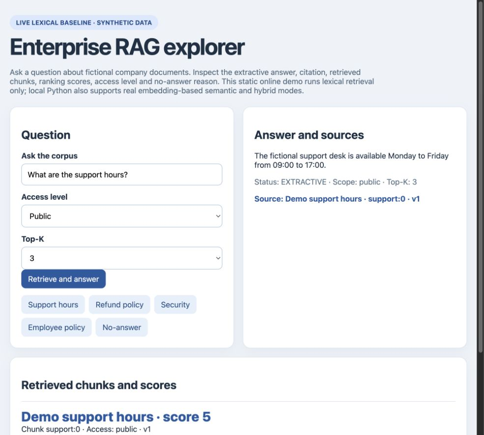
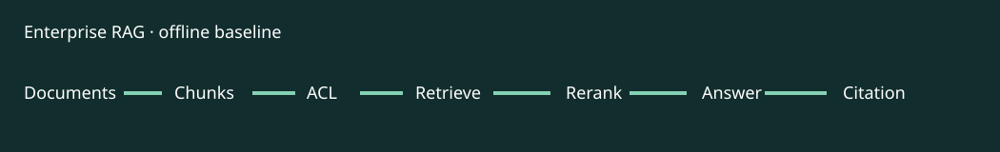

# Enterprise RAG Starter

**LIVE_DEMO (lexical) + LOCAL semantic/hybrid** · [Try the browser demo](https://zhouey314-cloud.github.io/enterprise-rag-starter/) · [Case study](docs/case-study.md) · [Resume bullets](docs/resume-bullets.md) · [Interview notes](docs/interview-notes.md)

An inspectable RAG demo using entirely fictional enterprise documents. The online page is a lexical baseline; optional local Python modes use a real sentence-embedding model for semantic and hybrid retrieval. Each mode extracts a source sentence with citation or reports insufficient evidence.



The image is a capture of the public lexical demo, not a generative model answer or production quality result.



## Demo

Online lexical demo: <https://zhouey314-cloud.github.io/enterprise-rag-starter/>. Try support hours, refund policy, security, employee policy (public no-answer; team-scope fictional document visible), and no-answer. The page shows answer, source, retrieved chunks, scores, access and no-answer reason. Scope selection is illustrative, not real authentication.

Python 3.10+: `python3 rag.py "What are the support hours?"`; `python3 rag.py "lunar engine warranty"`; `python3 -m unittest discover -s tests`; `python3 evals/run.py`.

Local semantic/hybrid setup:

```bash
python3 -m venv .venv
.venv/bin/python -m pip install -r requirements-semantic.txt
HF_HOME="$PWD/.model-cache" .venv/bin/python rag.py "When can I reach customer service?" --mode semantic
HF_HOME="$PWD/.model-cache" .venv/bin/python rag.py "What is the refund policy?" --mode hybrid --top-k 2
HF_HOME="$PWD/.model-cache" .venv/bin/python evals/modes.py
```

The first semantic run downloads `sentence-transformers/all-MiniLM-L6-v2` from Hugging Face into the ignored local cache. No API key is needed. Without installed dependencies or model access, semantic/hybrid raise an error; they never silently become lexical.

## Problem and architecture

Documents → parse → overlap chunk → metadata/access → lexical or local embedding cosine search → optional hybrid reciprocal-rank fusion → top-K selection → extractive answer + citation. The embedding adapter is replaceable; `LLMProvider` remains `NOT_CONFIGURED`, and no generative model runs. Access filtering happens before scoring in every mode. See [architecture](docs/architecture.md).

## Eval and verification

Nineteen tests cover chunking, access, citation, no-answer, top-K, mode routing and provider states. Four `synthetic_unverified` lexical fixtures remain as baseline; `evals/modes.py` checks retrieval Recall@1, citations, ACL, no-answer and top-K for lexical, semantic and hybrid, including paraphrases. The local semantic model was actually run; see [eval specification](evals/PROJECT_EVAL_SPEC.md). Answer quality from a generative model is `NOT_RUN`; extractive answers may still omit nuance. See [resume bullets](docs/resume-bullets.md) and [interview notes](docs/interview-notes.md).

## Status, privacy and roadmap

`IMPLEMENTED_AND_TESTED`: offline lexical retrieval, local optional semantic/hybrid retrieval, citation, access filter, deterministic synthetic fixtures. `DEPLOYED_STATIC_APP`: online lexical-only interface. `NOT_CONFIGURED`: generative LLM and external vector store. `NOT_IMPLEMENTED`: PDF parser, production authentication and provider-backed groundedness eval. All text is synthetic. Before production, add verified policy data, authenticated ACLs, expert-reviewed Golden Set and trace evaluation. MIT.
